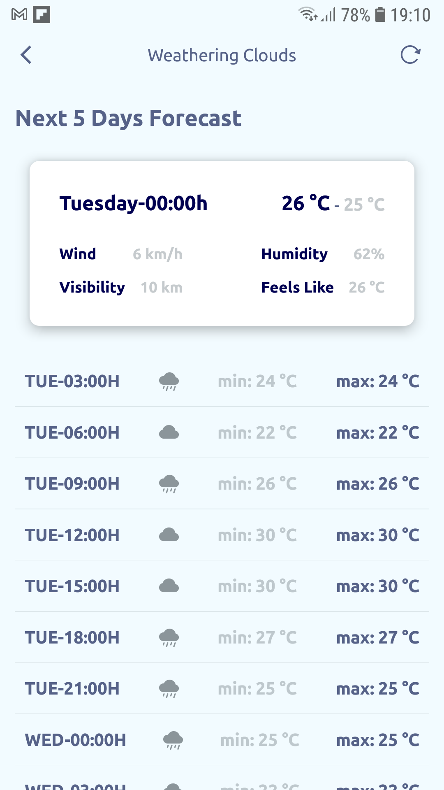

<h1 align="center">
    Weathering Clouds
</h1>

<p align="center">
   <a href="https://github.com/msvictor">
    
  </a>
</p>

<p align="center">
  <a href="https://developer.mozilla.org/pt-BR/docs/Web/JavaScript">
    
  </a>
  <a href="https://www.typescriptlang.org/">
    
  </a>
  <a href="https://reactnative.dev/">
    
  </a>
  <a href="https://docs.expo.dev/">
    
  </a>
  <a href="https://jestjs.io/pt-BR/">
    
  </a>
  <a href="https://styled-components.com/">
    
  </a>
  <a href="https://eslint.org/">
    
  </a>
    <a href="https://prettier.io/">
    
  </a>
    <a href="https://redux.js.org/">
    
  </a>
</p>

## Weathering Clouds

- [About](#about)
- [The Application](#application)
- [Techs](#techs)
- [Docs](#docs)
- [Clone and use](#clone)

<a id="about"></a>

## :interrobang: About

<strong>Weathering Clouds:</strong> a mobile application to see the weather condition. This application contain the informations of current day weather and also you can see the weather forecast of next five days. [Check the prototype here](https://www.figma.com/file/zUWW88a401vpUGS2L5g9Gk/Weathering-Clouds?node-id=0%3A1)

<strong>Project structure:</strong>
<br />
The main idea was develop a small <strong>"design system"</strong> with a theme and apply some concepts of atomic design in it. The structure contain four main folders: "common", "core", "mocks" and "modules".

in <strong>common module</strong> we have the theme config, the design system components, the assets of the project, the hooks and some utils functions. This module contain the files that can be used in whole project.

in <strong>core module</strong> we have the project configuration, on this module we have the files that make the project work like the global types, the main redux store, the app constants, the errors classes, the http providers, teh app routes, the main services, the translation file and the icon set map.

in <strong>mock module</strong> we have the files with some data fixed that can be used on tests.

in <strong>modules folder</strong> we have the files that can interact with each others, on this folders we have the app modules and in each module we have the app content: like app screens, the components used on the module, the services used on modules and the module redux reducer.


<a id="application"></a>

## :sparkles: The Application

<h4 align="center">
    Light Mode
</h4>
<h3 align="center">
    
    
    
</h3>
<h4 align="center">
    Dark Mode
</h4>
<h3 align="center">
    
    
    
</h3>


<a id="techs"></a>

## :diamonds: Techs

The project was developed with the technologies below:

- [Javacript](https://developer.mozilla.org/pt-BR/docs/Web/JavaScript)
- [Typescript](https://www.typescriptlang.org/)
- [React Native](https://expo.io/)
- [Expo](https://docs.expo.dev/)
- [Async Storage](https://react-native-async-storage.github.io/async-storage/docs/install/)
- [Axios](https://axios-http.com/docs/intro)
- [Date Fns](https://date-fns.org/)
- [ESLint](https://eslint.org/)
- [Jest](https://jestjs.io/pt-BR/)
- [Prettier](https://prettier.io/)
- [React Navigation](https://reactnavigation.org/)
- [React Native Bottom Sheet](https://gorhom.github.io/react-native-bottom-sheet/)
- [React Native Config](https://github.com/luggit/react-native-config)
- [React Native Icomoon](https://www.npmjs.com/package/react-native-icomoon)
- [React Native Testing Library](https://testing-library.com/docs/react-native-testing-library/intro/)
- [React Redux](https://redux.js.org/introduction/getting-started)
- [Redux Toolkit](https://redux-toolkit.js.org/introduction/getting-started)
- [Styled Components](https://styled-components.com/)


<a id="docs"></a>

## :clipboard: Docs
<strong>The Design System/Theme:</strong>
<br />

<strong>Typography</strong>
| token | size |
| ----- | ---- |
| xs    | 10   |
| sm    | 12   |
| md    | 14   |
| lg    | 16   |
| xl    | 18   |
| 2xl   | 20   |
| 3xl   | 24   |
| 4xl   | 28   |
| 5xl   | 32   |
| 6xl   | 64   |

<strong>How to use:</strong>

```typescript
import { Text } from '#common/components/primitives';

<Text fontSize="4xl">
	 Text with 4xl
</Text>
```

<strong>Font Family</strong>
| token  | font           |
| ------ | -------------- |
| bold   | Ubuntu-Bold    |
| italic | Ubuntu-Italic  |
| normal | Ubuntu-Regular |
| 300    | Ubuntu-Light   |
| 400    | Ubuntu-Regular |
| 500    | Ubuntu-Medium  |
| 700    | Ubuntu-Bold    |


<strong>How to use:</strong>

```typescript
import { Text } from '#common/components/primitives';

<Text fontWeight="500">
	 Text with font Ubuntu Medium
</Text>
```


<strong>Border Radius</strong>
| token  | radius |
| ------ | ------ |
| none   | 0      |
| xs     | 2      |
| sm     | 4      |
| md     | 6      |
| lg     | 8      |
| xl     | 10     |
| 2xl    | 12     |
| 4xl    | 30     |
| circle | 99999  |

<strong>How to use:</strong>

```typescript
import { View } from '#common/components/primitives';

<View rounded="circle">
	 View with border radius 99999
</View>
```

<strong>Spacing</strong>
| token | spacing |
| ----- | ------- |
| none  | 0       |
| xs    | 4       |
| sm    | 6       |
| md    | 8       |
| lg    | 12      |
| xl    | 24      |
| 2xl   | 32      |
| 3xl   | 64      |

<strong>How to use:</strong>

```typescript
import { View } from '#common/components/primitives';

<View p="xl" mt="lg">
	 View with padding 24 and margin top of 12
</View>
```

<strong>Shadows</strong>
| token | elevation |
| ----- | --------- |
| none  | 0         |
| xs    | 1         |
| sm    | 4         |
| md    | 8         |
| lg    | 12        |
| xl    | 16        |
| 2xl   | 20        |


<strong>How to use:</strong>

```typescript
import { View } from '#common/components/primitives';

<View bg="background" shadow="sm">
	 View with small shadow
</View>
```
<strong>Colors</strong>
| token       | light   | dark    |
| ----------- | ------- | ------- |
| fxYellow    | #F7C50A | #F7C50A |
| fxGray      | #8B959A | #8B959A |
| fxLightBlue | #4697EA | #4697EA |
| fxLightest  | #FFFFFF | #FFFFFF |
| fxDarkest   | #000051 | #000051 |
| background  | #F2FBFF | #070737 |
| text        | #566288 | #F5F5F5 |
| accent      | #F7430A | #4697EA |


<strong>How to use:</strong>

```typescript
import { View, Text } from '#common/components/primitives';

<View bg="background">
	 View with background color  #F2FBFF on light theme and #070737 on dark theme
</View>

<Text color="text">
	 Text with text color #566288 on light theme and #F5F5F5 on dark theme
</Text>
```

<strong>Tokens of components</strong>
| token               | value                                                 |
| ------------------- | ----------------------------------------------------- |
| p                   | padding                                               |
| pt                  | padding-top                                           |
| pr                  | padding-right                                         |
| pb                  | padding-bottom                                        |
| pl                  | padding-left                                          |
| px                  | padding-horizontal                                    |
| py                  | padding-vertical                                      |
| ps                  | padding-start                                         |
| m                   | margin                                                |
| mt                  | margin-top                                            |
| mr                  | margin-right                                          |
| mb                  | margin-bottom                                         |
| ml                  | margin-left                                           |
| mx                  | margin-horizontal                                     |
| my                  | margin-vertical                                       |
| ms                  | margin-start                                          |
| rounded             | border-radius                                         |
| roundedTopLeft      | border-top-left-radius                                |
| roundedTopRight     | border-top-right-radius                               |
| roundedBottomLeft   | border-bottom-left-radius                             |
| roundedBottomRight  | border-bottom-right-radius                            |
| roundedTop          | border-top-left-radius, border-top-right-radius       |
| roundedLeft         | border-top-left-radius, border-bottom-left-radius     |
| roundedRight        | border-top-right-radius, border-bottom-right-radius   |
| roundedBottom       | border-bottom-left-radius, border-bottom-right-radius |
| borderWidth         | border-width                                          |
| borderStartWidth    | border-start-width                                    |
| borderEndWidth      | border-end-width                                      |
| borderTopWidth      | border-top-width                                      |
| borderLeftWidth     | border-left-width                                     |
| borderRightWidth    | border-right-width                                    |
| borderBottomWidth   | border-bottom-width                                   |
| borderColor         | border-color                                          |
| borderTopColor      | border-top-color                                      |
| borderRightColor    | border-right-color                                    |
| borderLeftColor     | border-left-color                                     |
| borderBottomColor   | border-bottom-color                                   |
| flex                | flex                                                  |
| flexDir             | flex-direction                                        |
| flexWrap            | flex-wrap                                             |
| flexShrink          | flex-shrink                                           |
| justifyContent      | justify-content                                       |
| alignSelf           | align-self                                            |
| alignItems          | align-items                                           |
| color               | color                                                 |
| fontSize            | font-size                                             |
| fontStyle           | font-style                                            |
| fontWeight          | font-weight                                           |
| fontFamily          | font-family                                           |
| lineHeight          | line-height                                           |
| textAlign           | text-align                                            |
| textTransform       | text-transform                                        |
| letterSpacing       | letter-spacing                                        |
| textDecorationLine  | text-decoration-line                                  |
| textDecorationStyle | text-decoration-style                                 |
| textDecorationColor | text-decoration-color                                 |
| minH                | min-height                                            |
| minW                | min-width                                             |
| maxH                | max-height                                            |
| maxW                | max-width                                             |
| h                   | height                                                |
| w                   | width                                                 |
| position            | position                                              |
| top                 | top                                                   |
| right               | right                                                 |
| bottom              | bottom                                                |
| left                | left                                                  |
| bg                  | background                                            |
| bgImg               | background-image                                      |
| bgMode              | background-mode                                       |
| shadow              | shadow                                                |
| shadowColor         | shadow-color                                          |
| zIndex              | z-index                                               |
| overflow            | overflow                                              |


<a id="clone"></a>

## :octocat:Clone this repo

> First of all: this project use OpenWeatherMap Api, then to consume the weather-related data  you need to create an api key at: https://openweathermap.org/api. This key will be used on .env file as a environment variables on API_KEY field.

1. On command line terminal:
```sh
  $ https://github.com/msvictor/weathering_clouds.git
```

2. Go to folder:

```sh
  $ cd weathering_clouds
```

3. Configure:
```sh
  # ______LINUX / MACOS_______
  # make a copy of env file
  $ cp .env.staging .env
  # then edit it to add a OpenWeatherApi key to use
  $ vim .env
  # on edit mode add your key like below:
  # API_KEY=YOUR_API_KEY

  # ______WINDOWS_______
  # make a copy of env file
  $ copy .env.staging .env
  # then open the file on text editor and add a OpenWeatherApi key to use
  # on text editor add your key like below:
  # API_KEY=YOUR_API_KEY
```

4. Add the dependencies
```sh
  $ yarn
```

5. Run the app
```sh
  # on expo go app
  $ expo start

  # on android device
  $ yarn android

  # on ios device
  $ yarn ios
```


## :memo: License

This project is under MIT LICENSE. for more details follow the link: [LICENSE](LICENSE).
